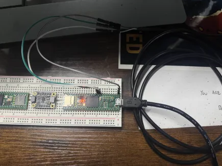

# UART to USB

## The Cable Itself

[UART to USB Cable](https://www.amazon.com/dp/B0D97V6PT9)

**IMPORTANT** You'll want the 3 pin one. This has Ground, RX, and TX. We don't want to draw power from the cable since the microcontrollers have their own power sources.

## TEENSY

**Black** To ground

**White** Pin 0 (Serial 1) or **Pin 7 (Serial 2)**

**Green** Pin 1 (Serial 1) or **Pin 8 (Serial 2)**

Since TS and PIMU are using pin 0, please make sure to hook up using Serial 2 version.

