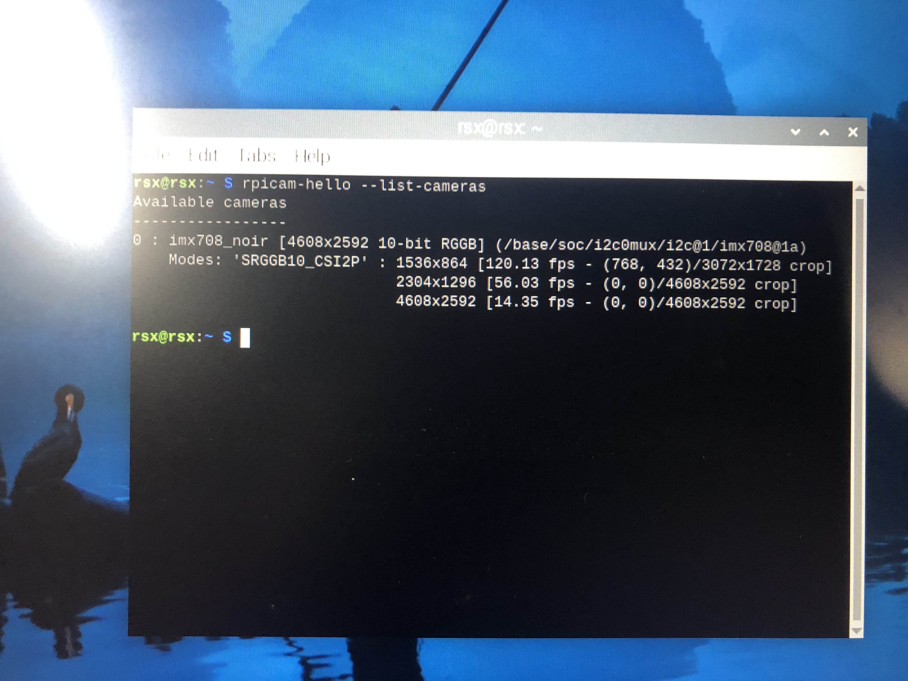
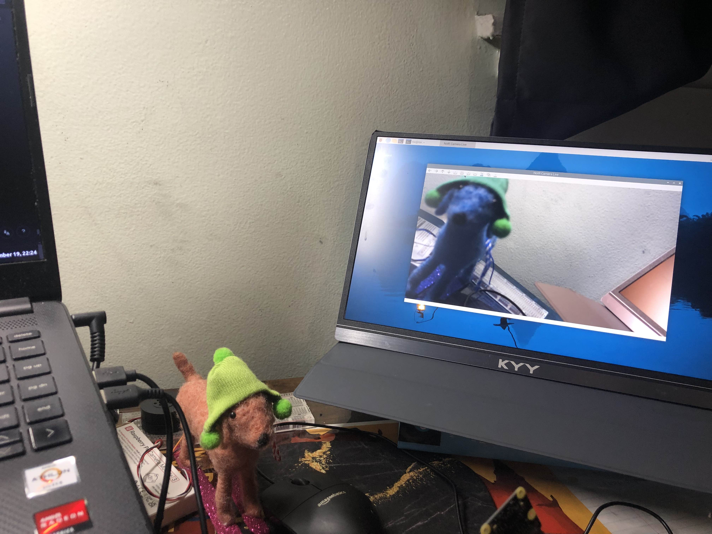

# How to Set Up Raspberry Pi Cameras on Raspberry PI

- Flash Raspberry Pi with Raspbian (I used Bookworm version)

- Update and upgrade

```
sudo apt update
sudo apt full-upgrade
sudo apt install libcamera-v412
```

- Before rebooting, make sure to enable I2C in "Interfacing Options" (Interfacing > I2C)

```
sudo raspi-config
```

- Update `/boot/firmware/config.txt` (ie. `sudo nano /boot/firmware/config.txt`). Ensure `camera_auto_detect=1`. Also add this after `[all]`:

```
dtoverlay=imx219
```

(After you've added this, you can do CNTRL + X and then save it.)

- Reboot:

```
sudo reboot
```

- Check to make sure the Pi recognizes the camera:

```
dmesg | grep -i camera
```



(If it's struggling, double-check and make sure the ribbon is plugged in with the blue side facing the ethernet.)

```
ls /dev/video*
```

(You'll want to make sure some `/dev/video` show up)

- Install python libraries

```
sudo apt install python3-picamera2 python3-opencv
```

- Run the script:

```
python3 capture_noir_footage.py
```

- It should cause a window to appear on the Raspberry Pi desktop (not sure how this would work if you're connecting to it over powershell). When you hit 'q', it should close and then save a h264 formatted video. 

